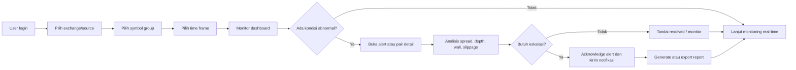
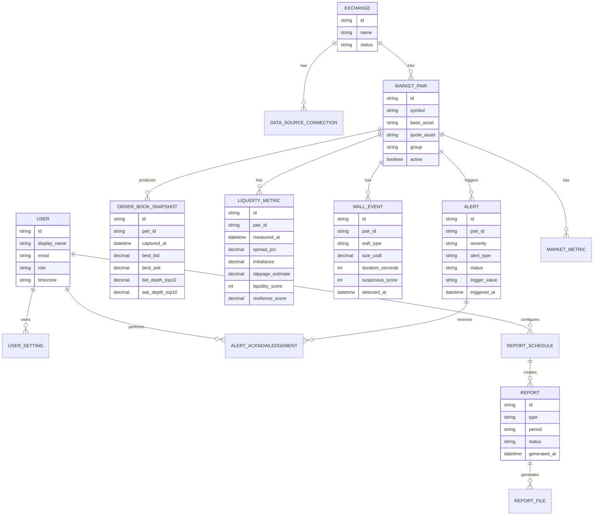
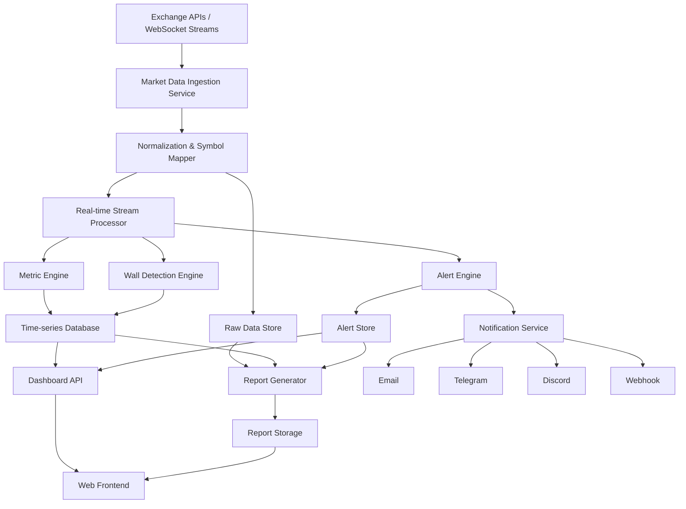
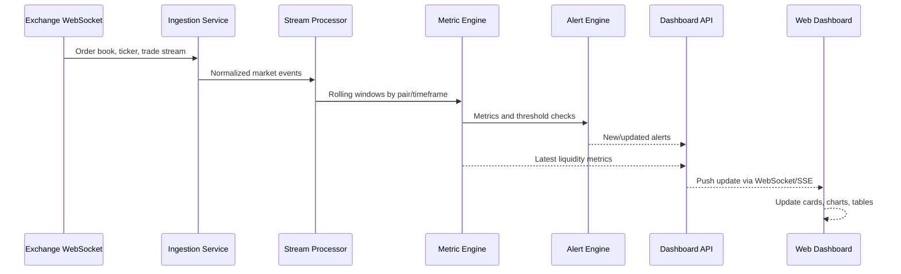

# PRD Website: Crypto Liquidity Monitoring Dashboard

## 1. Ringkasan Produk

Crypto Liquidity Monitoring Dashboard adalah aplikasi web real-time untuk market maker dan tim liquidity analysis dalam memantau kesehatan likuiditas pasar kripto, mendeteksi wall/order-book anomaly, mengelola alert, melihat analitik mikrostruktur pasar, serta menghasilkan laporan operasional.

Produk ini dirancang sebagai dashboard internal-profesional dengan tampilan gelap, data padat, refresh cepat, dan workflow yang berfokus pada keputusan operasional: kapan market maker perlu mengubah quote, memperketat spread, menambah inventory, meninjau pasangan aset, atau merespons risiko likuiditas.

## 2. Tujuan

1. Memberikan visibilitas real-time atas spread, depth, imbalance, slippage, wall activity, dan liquidity score.
2. Membantu market maker mendeteksi kondisi pasar abnormal seperti spoofing, liquidity drought, spread spike, latency tinggi, dan order-book imbalance.
3. Menyediakan pusat alert yang dapat diprioritaskan, diakui, dan ditelusuri berdasarkan pasangan aset.
4. Menyediakan analitik lanjutan untuk memahami rezim likuiditas, korelasi pair, order flow imbalance, dan performance market making.
5. Menyediakan pusat laporan untuk ekspor, preview, penjadwalan, dan histori laporan.
6. Memberikan konfigurasi fleksibel untuk exchange, data source, threshold, notifikasi, tema, dan preferensi ekspor.

## 3. Target Pengguna

| Persona | Kebutuhan Utama | Contoh Aktivitas |
|---|---|---|
| Market Maker | Memantau kondisi likuiditas dan order book secara cepat | Melihat spread, depth, slippage, wall bias, dan pair yang berisiko |
| Liquidity Analyst | Menganalisis tren likuiditas dan performa antar pair | Membandingkan pair, membaca heatmap, melihat regime analysis |
| Risk / Operations | Menangani alert dan anomali pasar | Acknowledge alert, cek penyebab, eskalasi issue |
| Admin / Lead | Mengatur koneksi exchange, threshold, user, dan laporan | Mengubah threshold, jadwal report, kanal notifikasi |

## 4. Problem Statement

Market maker membutuhkan dashboard yang menyatukan data order book, spread, depth, wall activity, alert, dan laporan dalam satu pengalaman yang cepat dan dapat dipercaya. Tanpa dashboard terpadu, tim harus memeriksa banyak sumber data, sulit mendeteksi anomali tepat waktu, dan lambat mengambil tindakan saat kondisi likuiditas berubah.

## 5. Ruang Lingkup Produk

### In Scope

- Dashboard overview real-time.
- Halaman Markets, Liquidity, Walls, Alerts, Analytics, Reports, dan Settings.
- Integrasi exchange/source data seperti Binance, Bybit, OKX, Kraken, Gate.io.
- Filter global: exchange/source, symbol group, time frame, auto refresh.
- Visualisasi chart, sparkline, table, gauge, heatmap, histogram, donut chart, dan order-book snapshot.
- Alert center dengan severity, status, action, pair-specific feed, dan notification channels.
- Report center dengan preview, download, scheduled reports, dan export preferences.
- Pengaturan threshold, API source, notification rules, account, theme, dan display preferences.

### Out of Scope

- Eksekusi order trading langsung.
- Portfolio accounting penuh.
- Custody, deposit, withdrawal, dan wallet signing.
- Backtesting strategi trading mendalam.
- Rekomendasi finansial otomatis.

## 6. Prinsip Desain

1. Data density tinggi namun tetap mudah dipindai.
2. Warna status konsisten: hijau untuk sehat/naik/aktif, merah untuk risiko/turun/kritis, kuning untuk caution/warning, biru untuk informasi.
3. Navigasi kiri tetap dengan modul utama.
4. Filter global selalu berada di area atas.
5. Chart dan tabel harus mendukung pembaruan real-time tanpa mengganggu fokus pengguna.
6. Semua angka kritis harus menampilkan timestamp, sumber data, dan indikator perubahan.
7. UI utama menggunakan mode dark sebagai default.

## 7. Information Architecture

```mermaid
flowchart TD
    A["Crypto Liquidity Monitoring Dashboard"] --> B["Overview"]
    A --> C["Markets"]
    A --> D["Liquidity"]
    A --> E["Walls"]
    A --> F["Alerts"]
    A --> G["Analytics"]
    A --> H["Reports"]
    A --> I["Settings"]

    B --> B1["Market Overview Table"]
    B --> B2["Liquidity Analytics"]
    B --> B3["Order Book Snapshot"]
    B --> B4["Market Maker Insights"]

    C --> C1["Market Heatmap"]
    C --> C2["Top Movers"]
    C --> C3["Futures vs Spot"]
    C --> C4["Market Analytics"]

    D --> D1["Liquidity Overview by Pair"]
    D --> D2["Spread Trend"]
    D --> D3["Depth Trend"]
    D --> D4["Slippage Curve"]
    D --> D5["Liquidity Insights"]

    E --> E1["Live Wall Monitor"]
    E --> E2["Wall Activity Timeline"]
    E --> E3["Wall Histogram"]
    E --> E4["Suspicious Wall Tracker"]

    F --> F1["Alert Summary"]
    F --> F2["Alert Center"]
    F --> F3["Pair-Specific Feed"]
    F --> F4["Warning Widgets"]

    G --> G1["Advanced Analytics Overview"]
    G --> G2["Correlation Matrix"]
    G --> G3["Regime Analysis"]
    G --> G4["Performance Diagnostics"]

    H --> H1["Report Center"]
    H --> H2["Report Preview"]
    H --> H3["Report Library"]
    H --> H4["Scheduled Reports"]

    I --> I1["Exchange Connections"]
    I --> I2["API Source Settings"]
    I --> I3["Threshold Settings"]
    I --> I4["Notification Rules"]
    I --> I5["User Preferences"]
```

## 8. User Flow Utama

## 9. Struktur Halaman dan Requirement

### 9.1 Global Layout

#### Komponen

- Sidebar kiri:
  - Logo.
  - Menu: Overview, Markets, Liquidity, Walls, Alerts, Analytics, Reports, Settings.
  - Collapse control.
- Header:
  - Judul: Crypto Liquidity Monitoring Dashboard.
  - Subtitle: Market Maker / Liquidity Analysis.
  - Theme toggle.
  - Notification bell.
  - User avatar, name, status online, account dropdown.
- Filter global:
  - Exchange / Source.
  - Symbol Group.
  - Time Frame: Real-time, 5M, 1H, 4H, 1D jika relevan.
  - Auto Refresh ON/OFF.
  - Last Update.
  - Export Report.

#### Acceptance Criteria

- Filter global memengaruhi semua widget pada halaman aktif.
- Last Update berubah setiap refresh data berhasil.
- Auto Refresh dapat dimatikan tanpa menghapus state filter.
- Sidebar menandai menu aktif secara jelas.
- Export Report tersedia dari semua halaman utama.

### 9.2 Overview

#### Tujuan

Memberikan ringkasan kondisi market maker lintas pair dalam satu layar.

#### Widget Utama

- KPI cards:
  - Average Spread %.
  - Max Spread %.
  - Average Imbalance.
  - Bid Depth Top 10.
  - Ask Depth Top 10.
  - Buy Wall Count.
  - Sell Wall Count.
  - Wall Bias.
  - Slippage Estimate.
  - Pair Count.
- Market Overview table:
  - Time, symbol, best bid, best ask, spread, bid qty, ask qty, imbalance, condition, buy wall, sell wall, liquidity status, suspicious score.
- Liquidity Analytics:
  - Spread trend.
  - Imbalance trend.
  - Wall activity.
  - Order book depth.
- Market Maker Insights:
  - Overall market status.
  - Buyer vs seller pressure.
  - Risk / attention.
  - Slippage outlook.
- Order Book Snapshot untuk selected pair.

#### Acceptance Criteria

- User dapat melihat pair mana yang sehat, caution, atau berisiko dalam kurang dari 10 detik.
- Suspicious score ditampilkan sebagai indikator visual.
- Order book snapshot berubah sesuai pair yang dipilih.
- Widget insight menampilkan rekomendasi operasional berbasis status, bukan nasihat finansial.

### 9.3 Markets

#### Tujuan

Menampilkan kondisi pasar kripto secara luas, termasuk spot, futures, dominance, volume, heatmap, top movers, dan market analytics.

#### Widget Utama

- Total Market Cap.
- 24H Spot Volume.
- 24H Futures Volume.
- BTC Dominance.
- ETH Dominance.
- Fear & Greed Index.
- Market Heatmap.
- Top Movers 24H: gainers, losers, high volume.
- Futures vs Spot Performance.
- Price Trends per pair.
- Funding Bias Summary.
- Market Analytics:
  - Market breadth.
  - Volatility trend.
  - Sector rotation.
  - Market dominance.
- Market Overview table.

#### Acceptance Criteria

- Heatmap mendukung toggle Market Cap dan 24H Change.
- Top Movers dapat berpindah tab gainers, losers, high volume.
- Futures vs Spot menampilkan basis dan funding.
- Semua data menampilkan sumber dan timestamp.

### 9.4 Liquidity

#### Tujuan

Menganalisis likuiditas per pair melalui spread, depth, slippage, imbalance, score, dan distribusi order book.

#### Widget Utama

- Average Spread.
- Max Spread.
- Bid Depth Top 10.
- Ask Depth Top 10.
- Top-of-Book Depth.
- Slippage Estimate.
- Liquidity Score.
- Order Book Resilience.
- Liquidity Overview table.
- Spread Trend.
- Depth Trend.
- Slippage Curve.
- Pair-by-Pair Liquidity Comparison.
- Order Book Depth Distribution.
- Depth Imbalance Distribution.
- Liquidity Insights.

#### Acceptance Criteria

- Liquidity score dihitung dan ditampilkan per pair.
- User dapat membandingkan top 10 pair berdasarkan spread dan total depth.
- Slippage curve dapat difilter berdasarkan order size.
- Insight menandai pair low-liquidity secara eksplisit.

### 9.5 Walls

#### Tujuan

Memantau buy wall, sell wall, wall persistence, suspicious wall, dan potensi spoofing.

#### Widget Utama

- Buy Wall Count.
- Sell Wall Count.
- Wall Bias.
- Average Wall Duration.
- Suspicious Score.
- Possible Spoof Alerts.
- Wall Persistence.
- Wall Activity 24H.
- Live Wall Monitor.
- Wall Activity Timeline.
- Buy vs Sell Wall Histogram.
- Wall Persistence by Duration.
- Suspicious Wall Tracker.
- Order Book Snapshot.

#### Acceptance Criteria

- Wall status memiliki label seperti Strong, Moderate, Weak.
- Suspicious score diberi warna berdasarkan threshold.
- Suspicious Wall Tracker dapat difilter all pairs atau pair tertentu.
- Timeline membedakan buy walls, sell walls, dan suspicious walls.

### 9.6 Alerts

#### Tujuan

Mengelola semua notifikasi risiko likuiditas dan operasional secara terpusat.

#### Widget Utama

- Critical Alerts.
- Warning Alerts.
- Info Alerts.
- Unacknowledged.
- Acknowledged.
- Total Alerts 24H.
- Notification Status.
- Alert Frequency.
- Severity Distribution.
- Affected Pairs.
- Alert Rules Triggered.
- Alerts Center table.
- Pair-Specific Alert Feed.
- Warning mini-cards.

#### Alert Attributes

| Field | Keterangan |
|---|---|
| Time | Waktu alert terdeteksi |
| Severity | Critical, Warning, Info |
| Symbol | Pair terdampak |
| Alert Type | Latency High, Spread Spike, Liquidity Deterioration, Suspicious Wall, Order Book Imbalance |
| Trigger Value | Nilai pemicu |
| Status | Unacknowledged, Acknowledged, Resolved |
| Action | View, acknowledge, more actions |

#### Acceptance Criteria

- User dapat filter alert berdasarkan severity, status, type, dan search keyword.
- User dapat acknowledge alert dari tabel.
- Pair-specific feed berubah sesuai selected pair.
- Notification channel status terlihat jelas.

### 9.7 Analytics

#### Tujuan

Menyediakan analitik lanjutan untuk market microstructure, regime, correlation, slippage, dan performance diagnostics.

#### Widget Utama

- Avg Spread 5m.
- Spread Volatility 5m.
- Liquidity Regime.
- Order Flow Imbalance.
- Slippage p95.
- Market Impact.
- Pair Correlation Avg.
- Quote Refresh Rate.
- Advanced Analytics Overview table.
- Spread Volatility Trend.
- Order Flow Imbalance chart.
- Pair Correlation Matrix.
- Liquidity Regime Analysis.
- Slippage Distribution.
- Market Microstructure Insights.
- Performance Diagnostics.
- Scenario Insights.

#### Acceptance Criteria

- Correlation matrix menampilkan pair utama secara konsisten.
- Liquidity regime dibagi minimal menjadi High, Normal, Fragile, Illiquid.
- Slippage distribution menampilkan p50, p90, p95, p99, dan average.
- Scenario insight menampilkan probability dan expected impact.

### 9.8 Reports

#### Tujuan

Menyediakan pusat laporan untuk membuat, melihat, mengunduh, menjadwalkan, dan melacak report.

#### Widget Utama

- Reports Generated.
- Total Exports.
- Avg Report Size.
- Data Points Processed.
- Delivery Success Rate.
- Scheduled Reports.
- Next Report Delivery.
- Storage Used.
- Report Center table.
- Report Preview.
- Report Library.
- Downloaded Files.
- Scheduled Reports table.
- Performance Snapshot.

#### Report Types

- Daily Liquidity Summary.
- Weekly Market Overview.
- Monthly Performance Report.
- Market Making Performance.
- Inventory & Exposure Analysis.
- Wall & Order Flow Report.
- Liquidity Provider Comparison.
- Custom Strategy Review.

#### Acceptance Criteria

- User dapat preview laporan sebelum download.
- User dapat download report PDF, Excel, atau CSV sesuai format.
- Scheduled report menampilkan frequency, next delivery, dan status.
- Delivery success rate dan storage used diperbarui otomatis.

### 9.9 Settings

#### Tujuan

Mengatur koneksi exchange, API source, refresh, threshold, wall detection, suspicious scoring, notification, tema, export, dan account.

#### Section

1. Exchange Connections.
2. API Source Settings.
3. Refresh & Update Settings.
4. Threshold Settings.
5. Wall Detection Settings.
6. Suspicious Score Settings.
7. Notification Rules.
8. Theme & Display Preferences.
9. Export Preferences.
10. User & Account Settings.
11. Save & Apply.

#### Acceptance Criteria

- Exchange connection menampilkan connected/disconnected.
- User dapat memilih primary data source dan fallback source.
- Threshold dapat di-reset ke default.
- Notification dapat dikirim via email, Telegram, Discord, atau webhook.
- Save Changes menampilkan feedback sukses/gagal.

## 10. Data Model Konseptual

## 11. Arsitektur Sistem

## 12. Data Flow Real-Time

## 13. Metric Definitions

| Metric | Formula / Definisi | Catatan |
|---|---|---|
| Spread % | `(best_ask - best_bid) / mid_price * 100` | Ditampilkan per pair dan rata-rata |
| Depth Top 10 | Total size pada 10 level order book teratas | Dipisah bid dan ask |
| Imbalance | `(bid_depth - ask_depth) / (bid_depth + ask_depth)` | Positif berarti buyer pressure |
| Slippage Estimate | Estimasi price impact untuk order size tertentu | Default 100K USDT |
| Liquidity Score | Skor komposit spread, depth, slippage, resilience | Skala 0-100 |
| Suspicious Score | Skor anomali wall berdasarkan size, durasi, cancel behavior | Skala 0-100 |
| Wall Persistence | Rasio wall yang bertahan melewati threshold durasi | Persentase |
| Order Flow Imbalance | Net buy/sell pressure dari stream trade/order book | Bisa positif/negatif |
| Quote Refresh Rate | Jumlah update quote per detik | Per exchange/pair |

## 14. Functional Requirements

| ID | Requirement | Priority |
|---|---|---|
| FR-001 | Sistem harus menyediakan dashboard real-time dengan filter global exchange, symbol group, dan time frame. | P0 |
| FR-002 | Sistem harus mengambil data market dari exchange API/WebSocket dan menampilkan status koneksi. | P0 |
| FR-003 | Sistem harus menghitung spread, depth, imbalance, slippage, liquidity score, dan wall metric. | P0 |
| FR-004 | Sistem harus menampilkan KPI cards dengan sparkline dan perubahan periode pembanding. | P0 |
| FR-005 | Sistem harus menampilkan order book snapshot untuk pair terpilih. | P0 |
| FR-006 | Sistem harus mendeteksi alert berdasarkan threshold yang dapat dikonfigurasi. | P0 |
| FR-007 | Sistem harus mendukung acknowledge dan filter alert. | P0 |
| FR-008 | Sistem harus menyediakan halaman reports dengan preview, download, library, dan scheduling. | P1 |
| FR-009 | Sistem harus mendukung export report dalam PDF, CSV, dan Excel. | P1 |
| FR-010 | Sistem harus menyediakan halaman settings untuk API source, threshold, notification, dan UI preference. | P1 |
| FR-011 | Sistem harus menyediakan visualisasi analytics lanjutan seperti correlation matrix dan regime analysis. | P1 |
| FR-012 | Sistem harus mendukung notifikasi via email, Telegram, Discord, dan webhook. | P2 |

## 15. Non-Functional Requirements

| Area | Requirement |
|---|---|
| Performance | Initial dashboard load maksimal 3 detik pada koneksi normal. |
| Real-time Latency | Update UI dari stream market data maksimal 1 detik setelah data diterima backend. |
| Availability | Target uptime 99.5% untuk MVP, 99.9% untuk production mature. |
| Scalability | Mendukung minimal 5 exchange, 500 pair aktif, dan 10.000 update per detik pada ingestion layer. |
| Reliability | Jika primary data source gagal, sistem memakai fallback source sesuai konfigurasi. |
| Security | API key exchange disimpan terenkripsi dan tidak pernah ditampilkan penuh di UI. |
| Auditability | Semua perubahan threshold, settings, dan alert action harus tercatat. |
| Accessibility | Kontras teks dan status harus memenuhi WCAG AA untuk mode dark. |
| Responsiveness | Layout minimal mendukung desktop 1440px ke atas; tablet sebagai secondary. |

## 16. Role & Permission

| Role | Permission |
|---|---|
| Viewer | Melihat dashboard, chart, dan report yang tersedia |
| Analyst | Viewer + export report, filter data, preview reports |
| Operator | Analyst + acknowledge alert dan manage scheduled reports |
| Admin | Operator + manage exchange connection, thresholds, notification, users |

## 17. Alert Rules

| Rule | Trigger Contoh | Severity Default |
|---|---|---|
| Latency High | API latency > 1000 ms | Critical |
| Spread Spike | Spread melewati threshold pair | Critical / Warning |
| Liquidity Deterioration | Depth turun > threshold dalam 5 menit | Warning |
| Suspicious Wall | Wall size besar dengan durasi pendek / pola cancel abnormal | Warning |
| Order Book Imbalance | Buy/sell imbalance melewati threshold | Info / Warning |
| Low Liquidity | Liquidity score turun di bawah threshold | Warning |
| Slippage Spike | Estimasi slippage melewati threshold | Warning |

## 18. Report Requirements

| Report | Isi Utama | Format |
|---|---|---|
| Daily Liquidity Summary | KPI harian, top pair, alert summary, liquidity score | PDF |
| Weekly Market Overview | Market cap, volume, top movers, volatility, dominance | PDF / Excel |
| Monthly Performance Report | P&L snapshot, spread capture, inventory turnover | PDF |
| Wall & Order Flow Report | Wall activity, suspicious score, spoof alerts | PDF / CSV |
| Inventory & Exposure Analysis | Exposure, concentration, risk summary | PDF / Excel |
| Custom Strategy Review | Template khusus berdasarkan konfigurasi user | PDF / Excel |

## 19. API Endpoint Draft

| Method | Endpoint | Fungsi |
|---|---|---|
| GET | `/api/exchanges` | Daftar exchange dan connection status |
| GET | `/api/symbol-groups` | Daftar symbol group |
| GET | `/api/dashboard/overview` | Data overview sesuai filter |
| GET | `/api/markets` | Data halaman markets |
| GET | `/api/liquidity` | Data liquidity per pair |
| GET | `/api/walls` | Data wall monitor |
| GET | `/api/alerts` | Daftar alert |
| PATCH | `/api/alerts/{id}` | Update status alert |
| GET | `/api/analytics` | Data advanced analytics |
| GET | `/api/reports` | Daftar laporan |
| POST | `/api/reports/export` | Generate export |
| GET | `/api/settings` | Ambil pengaturan user/admin |
| PATCH | `/api/settings` | Simpan pengaturan |
| WS | `/ws/market-stream` | Real-time update dashboard |

## 20. State dan Empty/Error Handling

| Kondisi | UI Behavior |
|---|---|
| Loading awal | Skeleton cards, table shimmer, chart placeholder |
| Exchange disconnected | Banner status dan tombol reconnect/manage |
| Data stale | Last Update diberi warna warning dan tooltip alasan |
| API error | Toast error, retry button, fallback jika tersedia |
| Tidak ada alert | Empty state ringkas: No active alerts |
| Report processing | Status badge Processing dan progress jika tersedia |
| Export gagal | Error message dan opsi retry |

## 21. Success Metrics

| Metric | Target MVP |
|---|---|
| Time to identify risky pair | < 10 detik |
| Alert acknowledgement rate | > 90% dalam 5 menit untuk critical |
| Dashboard data freshness | > 95% update tepat waktu |
| Report generation success rate | > 98% |
| User task completion untuk export report | > 95% |
| False positive suspicious wall alert | < 20% setelah tuning awal |

## 22. MVP Scope

### MVP Must Have

- Overview, Liquidity, Walls, Alerts, Reports, Settings.
- Binance sebagai exchange pertama.
- Symbol group Major Pairs.
- Time frame Real-time, 5M, 1H, 4H.
- KPI cards, market overview table, order book snapshot.
- Alert center dan acknowledge action.
- Export PDF/CSV sederhana.
- Threshold settings dasar.

### Post-MVP

- Multi-exchange production support.
- Advanced analytics penuh.
- Scheduled report delivery.
- Discord/Telegram/webhook notification.
- Role-based permission granular.
- Custom report builder.
- Mobile/tablet optimization.

## 23. Milestone

| Milestone | Deliverable | Estimasi |
|---|---|---|
| M1 Discovery & Design System | Final PRD, wireframe, token warna, komponen utama | 1-2 minggu |
| M2 Data Foundation | Ingestion Binance, normalization, metric engine dasar | 2-3 minggu |
| M3 Dashboard MVP | Overview, Liquidity, Walls, global filters, WebSocket UI | 3-4 minggu |
| M4 Alert & Settings | Alert rules, acknowledge, threshold settings | 2 minggu |
| M5 Reports | Report center, export PDF/CSV, report library | 2 minggu |
| M6 Hardening | Performance, error handling, audit log, QA, security review | 2 minggu |

## 24. Risiko dan Mitigasi

| Risiko | Dampak | Mitigasi |
|---|---|---|
| Rate limit exchange API | Data delay atau disconnect | Gunakan WebSocket, caching, fallback source |
| Data antar exchange tidak konsisten | Metric bias | Normalization layer dan source tagging |
| Terlalu banyak visualisasi | Dashboard sulit dibaca | Prioritaskan hierarchy dan progressive detail |
| False positive alert tinggi | Alert fatigue | Threshold tuning, severity calibration, feedback loop |
| Chart update terlalu sering | UI terasa berat | Batch update dan window aggregation |
| API key leakage | Risiko keamanan tinggi | Encryption, masking, RBAC, audit log |

## 25. Open Questions

1. Apakah dashboard akan dipakai internal saja atau sebagai SaaS multi-tenant?
2. Exchange mana yang wajib didukung pada fase pertama selain Binance?
3. Apakah sistem perlu terhubung ke strategi market making internal untuk action recommendation?
4. Apakah P&L dan inventory akan dihitung dari data internal atau hanya dari exchange?
5. Apakah laporan perlu dikirim otomatis ke email/Slack/Telegram pada MVP?
6. Apakah ada standar compliance atau audit khusus yang harus dipenuhi?

## 26. Glossary

| Istilah | Definisi |
|---|---|
| Market Maker | Pelaku yang menyediakan likuiditas dengan quote bid/ask |
| Spread | Selisih antara best ask dan best bid |
| Depth | Total likuiditas pada level order book tertentu |
| Wall | Order besar pada sisi bid atau ask yang dapat memengaruhi persepsi pasar |
| Slippage | Perbedaan harga estimasi dengan harga eksekusi akibat kedalaman order book |
| Imbalance | Ketidakseimbangan antara bid depth dan ask depth |
| Liquidity Regime | Klasifikasi kondisi likuiditas seperti High, Normal, Fragile, Illiquid |
| Spoofing | Praktik menempatkan order besar tanpa niat eksekusi untuk memengaruhi pasar |

