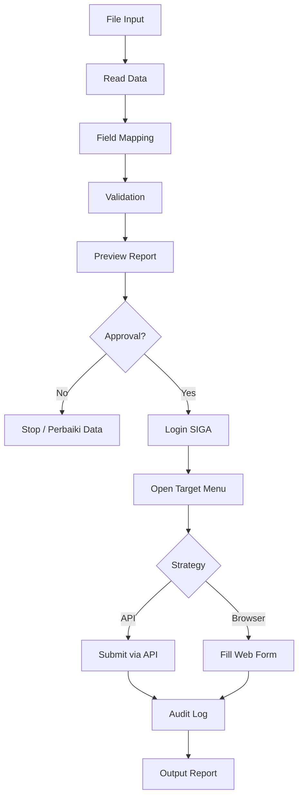

# Arsitektur AI Agent Input Data SIGA

## Tujuan

AI agent dirancang untuk mengotomatisasi input data ke web SIGA dengan tetap menjaga kontrol manusia sebelum data dikirim.

Agent tidak langsung mengubah data produksi. Semua data harus melewati tahap parsing, mapping, validasi, preview, dan approval.

## Komponen Utama

### 1. Input Reader

Tanggung jawab:

- Membaca file CSV atau Excel dari `data/input/`.
- Mengubah data menjadi format baris terstruktur.
- Menyimpan metadata file sumber.

Lokasi:

- `src/integrations/file_loader.py`

### 2. Field Mapper

Tanggung jawab:

- Mencocokkan kolom sumber ke field tujuan SIGA.
- Menggunakan konfigurasi mapping dari `config/field_mapping.example.json`.
- Menandai field yang belum cocok.

Lokasi:

- `src/agent/mapper.py`

### 3. Validation Engine

Tanggung jawab:

- Memeriksa field wajib.
- Memeriksa format tanggal, nomor telepon, NIK, kode wilayah, dan nilai angka.
- Memberi status `valid`, `warning`, `error`, atau `duplicate`.

Lokasi:

- `src/validation/rules.py`

### 4. Review Gate

Tanggung jawab:

- Membuat file preview.
- Menahan proses submit sampai user menyetujui.
- Mencegah submit ketika masih ada error kritis.

Lokasi:

- `src/agent/review_gate.py`

### 5. SIGA Client

Tanggung jawab:

- Login ke SIGA.
- Mengelola token sesi.
- Mengambil menu user.
- Membaca opsi wilayah dari SIGA dan mencocokkan input user ke opsi aktual.
- Mengirim data melalui API jika endpoint sudah diketahui.
- Menggunakan browser automation jika endpoint belum tersedia atau form sangat dinamis.

Lokasi:

- `src/siga/auth.py`
- `src/siga/api_client.py`
- `src/siga/location_resolver.py`
- `src/siga/menu.py`
- `src/siga/browser_automation.py`

### 6. Workflow Runner

Tanggung jawab:

- Menjalankan proses khusus per menu.
- Mengatur urutan langkah input data.
- Menentukan strategi submit per target.

Lokasi:

- `src/workflows/`

### 7. Audit Logger

Tanggung jawab:

- Mencatat job id.
- Mencatat file sumber.
- Mencatat jumlah berhasil, gagal, dan dilewati.
- Mencatat error dari SIGA.
- Tidak mencatat password atau token.

Lokasi:

- `src/agent/audit_logger.py`

## Strategi Integrasi

### Prioritas 1: API Resmi Aplikasi

Jika endpoint API untuk menu target bisa dipastikan dari aplikasi, agent memakai API karena lebih stabil dan cepat.

### Prioritas 2: Browser Automation

Jika endpoint sulit dipastikan, agent memakai browser automation untuk membuka form, mengisi field, dan submit seperti operator manusia.

### Prioritas 3: Semi-Automation

Jika form berisiko tinggi atau belum stabil, agent hanya menyiapkan data dan memberi instruksi input manual.

## Status Data

- `pending`: data baru dibaca.
- `mapped`: data sudah dipetakan.
- `valid`: data lolos validasi.
- `warning`: data perlu perhatian tetapi masih bisa diproses.
- `error`: data tidak boleh dikirim.
- `approved`: data disetujui untuk submit.
- `submitted`: data berhasil dikirim.
- `failed`: data gagal dikirim.
- `skipped`: data dilewati.

## Diagram Alur

